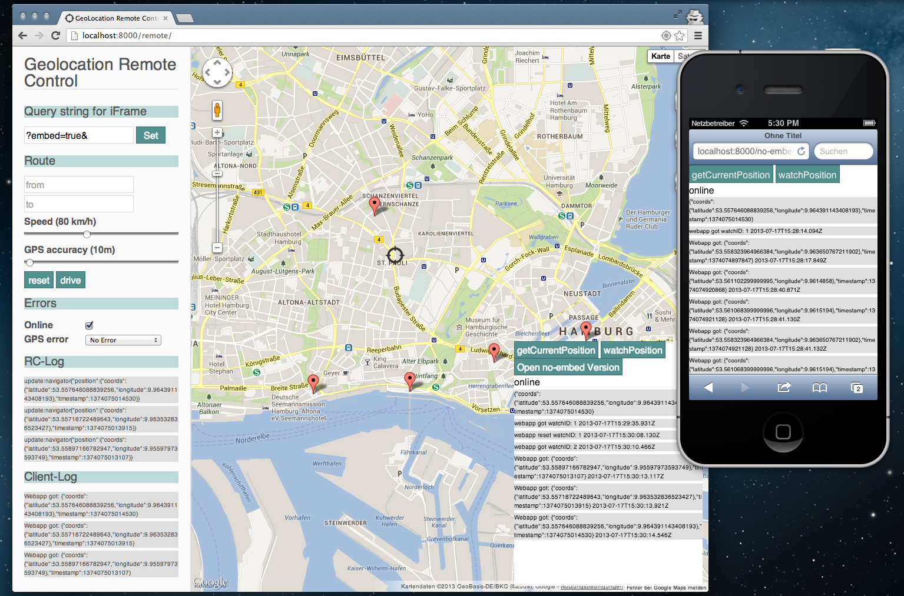

# Geolocation Remote
### Control the Location of Your Mobile Device

It is hard to test mobile applications where the location changes frequently. This tool lets you take over control of your `navigator.geolocation` by overriding the existing APIs using data from a simple socket connection.

This a small app to run a geolocation webapp in the browser with debugging possibilities. The webapp in question is inserted as an iframe and the geolocation api is overwritten to use the one we provide. This one is build to work with google maps to show where exactly we are now in the webapp.

## Installation

You can clone and build the remote control yourself. It's a yo/grunt project.

But you can copy the contents of the dist folder (which is the complete remote folder) to your webapp root and access you webapp with http://[webapp root]/remote.

Add client-scripts.js in the remote scripts folder to tweak your app behaviour. Use it for your own scripts that you need to debug your webapp with but dont want to remove for your build process. The default one is not used for the remote-control build, allthough you could just copy it as a starting point.

### Remote <=> App connection

There are two possible ways to connect the remote to the app. If you only use the iFramed App in the same browser window then you use postMessages to communicate between iFrames by default.

The other way is via sockets. In favor of pusher (http://pusher.com/) we removed socket.io as socket server. Socket.io was not going anywhere since 7 month at the time of this writing and we had problems connecting to iOS. To be able to trigger messages from javascript you need to start your own auth server. An example is in the ```app/pusher/pusher-auth.js```. You can start this server with a simple grunt-express (https://github.com/blai/grunt-express) grunt task.

```js
grunt.initConfig({
  express: {
    pusher: {
      options: {
        port: 5000,
        server: 'app/pusher/pusher-auth.js'
      }
    }
  }
});
```

The config for pusher is located in ```remote-config.js```.

## Example

To have an example what you can do just clone this repo. Do <code>npm install</code> and <code>bower install</code>.
Then run <code>grunt server</code>. A page will open in your browser and you can play a little.

You can open the no-embed version (link is provided in the app) in every device to check different locations.
In the no-embed version you dont have the possibility to log client data to the remote.

## Screenshot



## About

Developed at [Ubilabs](http://ubilabs.net).

TODO:
* resizeable iFrame
* nicerer infoWindow
